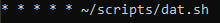
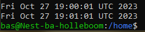

# Cron Jobs
Making tasks run on a schedule

## Key-terms
[Schrijf hier een lijst met belangrijke termen met eventueel een korte uitleg.]

## Opdracht
### Gebruikte bronnen
[date in script info](https://www.cyberciti.biz/faq/unix-linux-getting-current-date-in-bash-ksh-shell-script/)  
[chrontab.guru](https://crontab.guru/)
[chrontab info](https://phoenixnap.com/kb/set-up-cron-job-linux)  
medestudent comment: sudo timedatectl >> currenttime.txt Als je dit in .sh script plaats dan werkt het
### Ervaren problemen
[Geef een korte beschrijving van de problemen waar je tegenaan bent gelopen met je gevonden oplossing.]  
[available disk space info](https://www.linuxfoundation.org/blog/blog/classic-sysadmin-how-to-check-disk-space-on-linux-from-the-command-line)

### Resultaat
    now=$(date)
    echo "$now"
hiermee print hij de datum locaal  
dat.sh als script, dats.txt als storage

dat.sh  
    now=$(date)
    echo "$now">>/home/dats.txt  

    crontab -e
dit opent cronjob bestand, heb ingesteld op nano als editor  
gebruikte command binnen crontab  
  
  

#### sub-exercise 3
    df -H  
dit lijkt de command te zijn, naam script: diskspacecheck.sh  
werkt, nu naar /var/logs  
deze directory lijkt niet te bestaan, aanmaken in bas, had steeds sudo nodig  
uiteindelijk gecreërde log document: ~/var/logs/diskspacelog.txt  
gebruikte code diskspacecheck.sh  
    now=$(date)  
    echo "$now">>/var/logs/diskspacelog.txt  
    df -H>>/var/logs/diskspacelog.txt  
hiermee laat hij de datum boven iedere log zien, wel zo makkelijk  
heb de command "@weekly" gebruikt binnen crontab, lijkt te werken, zal hem zondag middernacht moeten doen  
maandag controleren of dit idd werkte  
Controle maandag: Het werkte; de log is gemaakt op Sun Oct 29 00:00:02 UTC 2023  
Note van Allard / --output=avail achter df selecteerd de output op alleen de totale schijfruimte  
[Bron van Allard](https://stackoverflow.com/questions/28809148/how-to-select-a-particular-column-in-linux-df-command)
