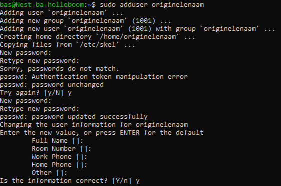
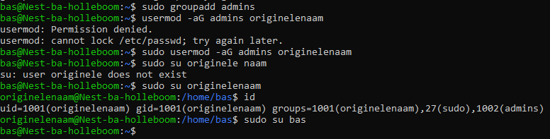
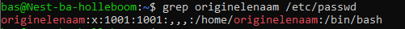

# Users & Groups
creëren van nieuwe user

## Key-terms
root - mag alles doen in een server
sudo - geeft iemand tijdelijk root

## Opdracht
### Gebruikte bronnen
sudo uitleg binnen cmd  
  
[add users and give them password](https://support.stackpath.com/hc/en-us/articles/360025308732-Add-Users-to-a-Virtual-Machine)  
[cheatsheet linux commands](https://phoenixnap.com/kb/linux-commands-cheat-sheet#users-and-groups)

### Ervaren problemen

### Resultaat
met sudo adduser <naam> nieuwe user toegevoegd, vroeg automatisch om aanmaak password  
  
Nu kijken naar admin groep gedeelte  
groep aangemaakt, user aan groep toegevoegd.  
  
locating files that store user data  
binnen /etc/ lijkt user data te staan. met grep <username> /etc/passwd krijg ik dit als output  

