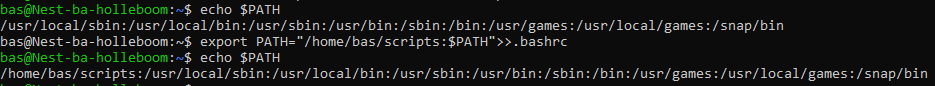
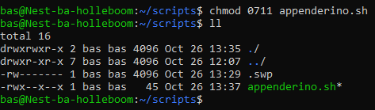
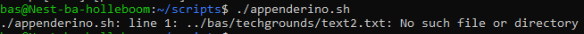
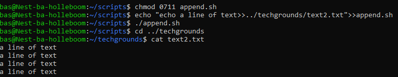
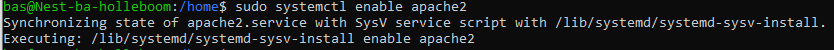
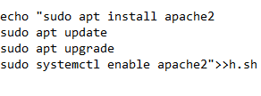
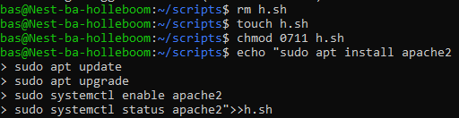
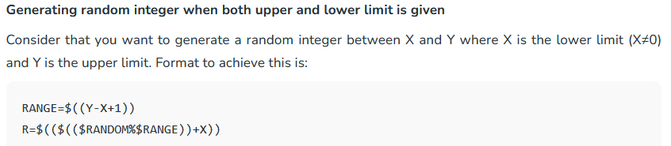
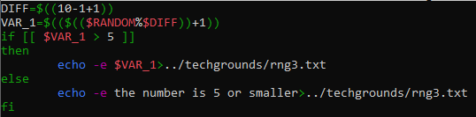

# Bash Scripts
Maken van scripts map en oefenen met Bash scripts

## Key-terms
Bash script - series of commands written in text file  
PATH variable - iets waaraan je je scriptmap toevoegt zodat linux het kan vinden  
append - 

## Opdracht
### Gebruikte bronnen
[add a directory to PATH](https://phoenixnap.com/kb/linux-add-to-path)  
[running .sh file](https://www.cyberciti.biz/faq/run-execute-sh-shell-script/)  
[ubuntu package management](https://ubuntu.com/server/docs/package-management)  
[rng codes](https://blog.eduonix.com/shell-scripting/generating-random-numbers-in-linux-shell-scripting/)  
[rng codes 2](https://www.geeksforgeeks.org/random-shell-variable-in-linux-with-examples/)  
[rng codes 3](https://www.baeldung.com/linux/random-numbers)  
[variable name notes](https://www.tutorialspoint.com/unix/unix-using-variables.htm)
[conditional expression](https://www.thegeekstuff.com/2010/06/bash-conditional-expression/)

### Ervaren problemen
[Geef een korte beschrijving van de problemen waar je tegenaan bent gelopen met je gevonden oplossing.]

### Resultaat
Met echo $PATH laat hij de geconfigureerde directories zien  
    export PATH="/home/bas/scripts:$PATH">>.bashrc  
hiermee locatie toegevoegd; NOOT: deed dit per ongeluk 2x in de .bash ipv .bashrc  
  
"Create a script that appends a line of text to a text file whenever it is executed" append is dus achter aan toevoegen, dus gewoon ">>" gebruiken  
met <echo >appenderino.sh> eerste bash aangemaakt, met <echo ">>a line of text">appenderino.sh> het command voor het toevoegen van "a line of text" toegevoegd
moet het appenden naar een specifiek text file doen  
hermaakte appenderino.sh met <touch appenderino.sh>, vervolgde met <echo "a line of text>>../bas/techgrounds/text2.txt">>appenderino.sh>  
nu appenderino executable maken voor mezelf  
  
met ./<.sh file> kan je executen  
herkende locatie niet  
  
juiste command was <echo "echo a line of text>>../techgrounds/text2.txt">>append.sh>  
  

  
Next: Create a script that installs the httpd package, activates httpd, and enables httpd. Finally, your script should print the status of httpd in the terminal.: 

Created h.sh for this purpose  
begrijp dat httpd an sich niet bestaat, maar alleen subversies, teamgenoot gebruikte apache2  
moet vermoedelijk met get?  
[sudo apache2 update/grade commands](https://synaptica.info/en/2023/03/23/ubuntu-lts-update-apache2-to-the-lastest-version-via-ssh/)  
apache2 enable  
  
succes met invullen eerste stappen in script, alleen status nog

  

volle code wat ik in h.sh plakte  
    echo "sudo apt install apache2
sudo apt update
sudo apt upgrade
sudo systemctl enable apache2
sudo systemctl status apache2">>h.sh  
resultaat  
  

#### exercise 2 random number generator
[rng](https://blog.eduonix.com/shell-scripting/generating-random-numbers-in-linux-shell-scripting/)  
random number generator within 'Y' R=$(($RANDOM%Y)), voor 0-10 echo $(($RANDOM%11))  
  
    echo $random RANGE=$((10-1+1)) R=$(($(($RANDOM%$RANGE))+1))  
lijkt te werken  
werkende code:  
    DIFF=$((10-1+1))  
    VAR_1=$(($(($RANDOM%$DIFF))+1))  
    echo -e $VAR_1>../techgrounds/rng.txt  

#### exercise 3
poging 1  
    DIFF=$((10-1+1))  
    VAR_1=$(($(($RANDOM%$DIFF))+1))  
    if VAR_1>5 echo -e $VAR_1>../techgrounds/rng3.txt  
    elif VAR_1>5 echo the number is 5 or smaller>../techgrounds/rng3.txt  

succes  
  
