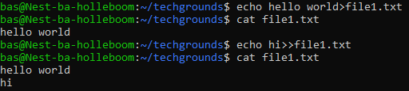

# Working with text (CLI)
werken in documenten

## Key-terms
stin (standard input)  
stout (standard output)  

	
## Opdracht
### Gebruikte bronnen
[online manual navigation+file creatie](https://www.pluralsight.com/guides/beginner-linux-navigation-manual)  
[file creatie bron 2](https://monovm.com/blog/how-to-create-a-text-file-in-linux/)  

### Ervaren problemen

### Resultaat
invoegen van nieuwe zin

  

invoeren en zoeken zin met 'techgrounds'

  

Vinden en redirecten zin met 'techgrounds'

[Vinden en redirecten zin met 'techgrounds'](/01_Linux_1/images/redirect.png)
