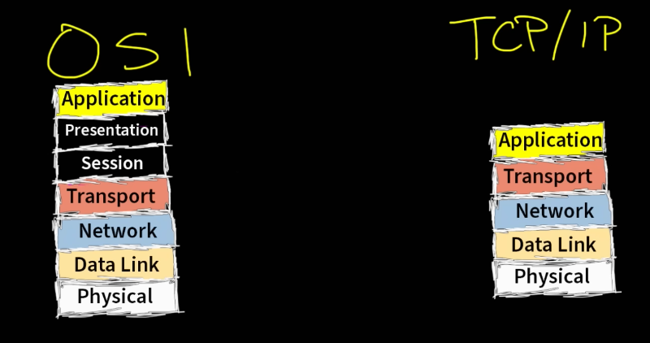

# OSI Stack
Introduction of OSI model and TCP/IP model

## Key-terms
OSI model - Open System Interconnection model  
TCP/IP model - Transmission Control Protocol / Internet Protocol suite  
bottom-up en top-down approach - troubleshooting gaat vaak de lagen door van laag naar hoog of hoog naar laag

## Opdracht
### Gebruikte bronnen
[youtube what is TCP/IP and OSI](https://www.youtube.com/watch?v=CRdL1PcherM)  
[wiki link TCP/IP](https://en.wikipedia.org/wiki/Internet_protocol_suite)  
[OSI uitleg](https://www.imperva.com/learn/application-security/osi-model/)

### Ervaren problemen
[Geef een korte beschrijving van de problemen waar je tegenaan bent gelopen met je gevonden oplossing.]

### Resultaat
TCP/IP is het netwerkmodel dat wordt gebruikt op iedere computer  
Rules, guidelines, standards; functies verdeeld in lagen  
Layers: Physical, Network, Transport, Application  
physical layer soms verdeeld in physical (ethernet cables ed) en data link (adresses, switches)  
network layer = IP adressen  
OSI heeft twee extra lagen: Session en Presentatie  
  

