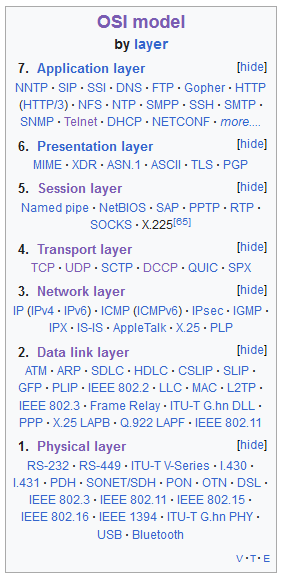
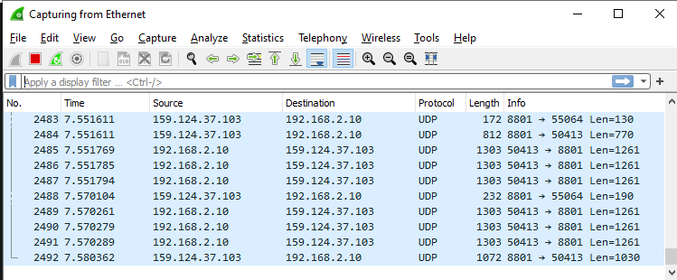

# Protocols
Leren over netwerk protocollen

## Key-terms
Communication Protocols - as defined by wikipedia: A communication protocol is a system of rules that allows two or more entities of a communications system to transmit information via any variation of a physical quantity. The protocol defines the rules, syntax, semantics, and synchronization of communication and possible error recovery methods. Protocols may be implemented by hardware, software, or a combination of both.  
Layer 4 protocols:  
TCP - Transmission Control Protocol, complexm used for connection-oriented transmissions  
UDP - User Datagram Protocol used for simpler messaging transmissions  
TCP is more reliable, UPD is faster
ISO - International Organization for Standardization  
ITU - International Telecommunication Union  
IEEE - Institute of Electrical and Electronics Engineers  
IETF - Internet Engineering Task Force  

## Opdracht
### Gebruikte bronnen
[wiki transport layer](https://en.wikipedia.org/wiki/Transport_layer)  
[wiki communication protocols](https://en.wikipedia.org/wiki/Communication_protocol)  
[uitleg OSI protocols](https://www.techopedia.com/definition/24961/osi-protocols)  
[ISO informatie](https://en.wikipedia.org/wiki/International_Organization_for_Standardization)

### Ervaren problemen
[Geef een korte beschrijving van de problemen waar je tegenaan bent gelopen met je gevonden oplossing.]

### Resultaat
#### subexercise 1
##### Identify several other protocols and their associated OSI layer. Name at least one for each layer.
Overzicht protocollen verschillende lagen:  
  
Layer 7: DNS - Domain Name System, hierarchisch, naming system die informatie associeerd met domain domeinnamen
Layer 6: ASCII - vertalingsprotocol van bits naar text, ook leuk voor het maken van kunst  
Layer 5: SOCKS - uitwisselen van netwerkpaketten tussen client en server
Layer 4: DCCP - Datagram Congestion Control Protocol, message oriented, goed voor situaties waarin snel data moet worden verstuurd, denk dingen als online games  
Layer 3: IPv4 - Internet Protocol version 4, adres systemen en routing, packet forwarding; zie ook: IP adres  
Layer 2: MAC - Medium Access Control, hardware die zorgt voor verbinding tussen wireless en wired netwerken  
Layer 1: USB - Universal Serial Bus, communicatie en stroomtoevoer tussen veel verschillende soorten apparaten  

#### subexercise 2
##### Figure out who determines what protocols we use and what is needed to introduce your own protocol
ISO, ITU, IEEE en IETF houden zich veel bezig met de standaardisatie, er wordt veel geworkshopt en gedraft etcetera

#### subexercise 3
##### Look into wireshark and install this program. Try and capture a bit of your own network data. Search for a protocol you know and try to understand how it functions.
Wireshark snapshot:  
  
Voorkomend protocol: UDP - User Datagram Protocol, transport level/level 4. Verstuurd berichten als datagrammen/packets.