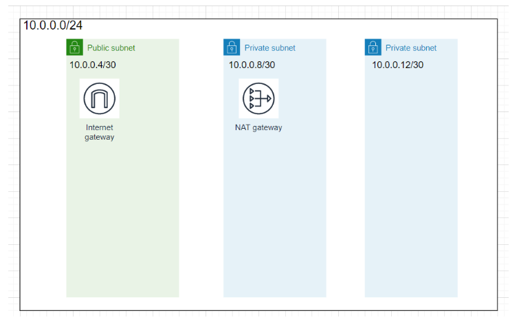
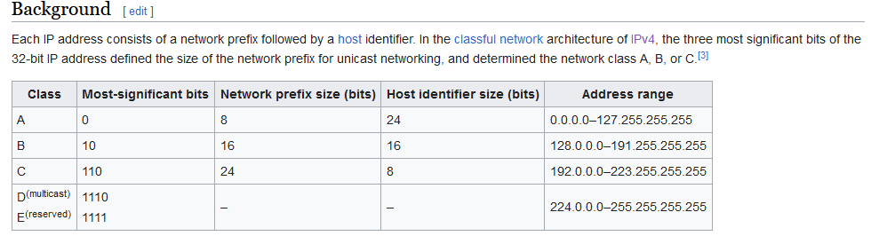
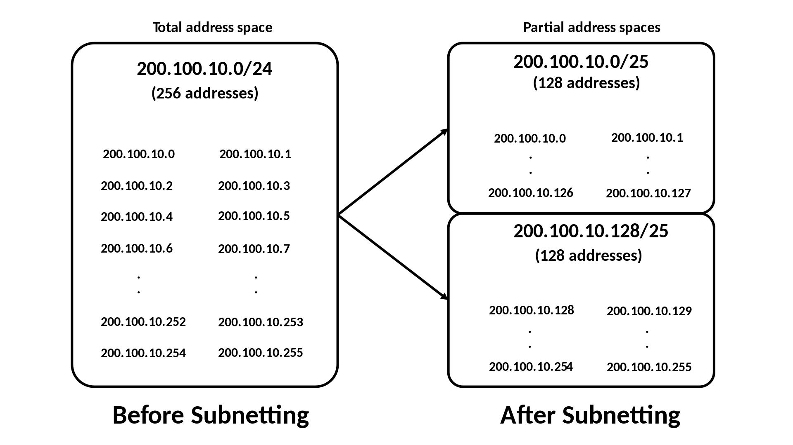

# Subnetting
[Geef een korte beschrijving van het onderwerp]

## Key-terms
LAN - Local Area Network  
subnet - kleiner netwerk dat onderdeel is van een groter netwerk  
CIDR notation - Classless Inter-Domain Routing, method for allocating IP adresses and for IP routing - wikipedia

## Opdracht
### Gebruikte bronnen
[diagram maker](https://app.diagrams.net/)
[subnet calculator](https://www.calculator.net/ip-subnet-calculator.html)  
[CIDR](https://en.wikipedia.org/wiki/Classless_Inter-Domain_Routing)  
[subnet](https://en.wikipedia.org/wiki/Subnet)  
  
[gateway info](https://en.wikipedia.org/wiki/Gateway_(telecommunications))  

### Ervaren problemen
[Geef een korte beschrijving van de problemen waar je tegenaan bent gelopen met je gevonden oplossing.]

### Resultaat
Eisen exercise:  
    1 subnet dat alleen van binnen het LAN bereikbaar is. Dit subnet moet minimaal 15 hosts kunnen plaatsen.
    1 subnet dat internet toegang heeft via een router met NAT-functionaliteit. Dit subnet moet minimaal 30 hosts kunnen plaatsen (de 30 hosts is exclusief de router).
    1 subnet met een network gateway naar het internet. Dit subnet moet minimaal 5 hosts kunnen plaatsen (de 5 hosts is exclusief de internet gateway).

Wiki quote: 198.51.100.0/24 is the prefix of the Internet Protocol version 4 network starting at the given address, having 24 bits allocated for the network prefix, and the remaining 8 bits reserved for host addressing. Addresses in the range 198.51.100.0 to 198.51.100.255 belong to this network, with 198.51.100.255 as the subnet broadcast address  

Voor een subnet van 15 host zou je dan 4 binary bits nodig hebben dus een subnet van 4?  
Je hebt 5 bits nodig voor 30 hosts  
Mogelijk fout

  
  
met /24 heb je 256 adressen, met /25 128  
26=64, 27=32, 28=16, 29=8, 30=4, 31=2, 32=1  
zou het dan een /28 zijn voor punt 1, en een /27 voor punt 2?  
volgens de subnet calculator geeft 28 een total number of host van 16 en usable van 14  
zou het dan een /27 een /26 moeten zijn?  
Dit doet me denken over de "x hosts exclusief de router" comments. Ik vermoed dat 28 dan wel goed is voor punt 1 aangezien het los van de router is, voor punt 2 is dan wel 26 nodig omdat de router wel meedoet.  
voor punt 3 lijkt een network gateway ook normaal gesproken NAT functionaliteit te hebben?

Dit gaat dan worden:  
10.0.0.0/24  
LAN subnet          Router subnet           Network Gateway subnet  
10.0.0.1/28         10.0.0.2/26             10.0.0.3/29
