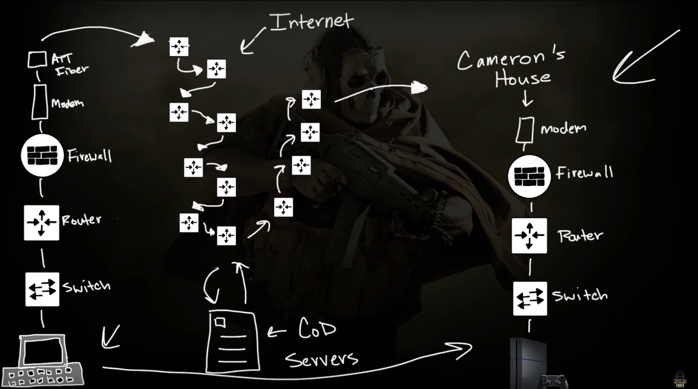
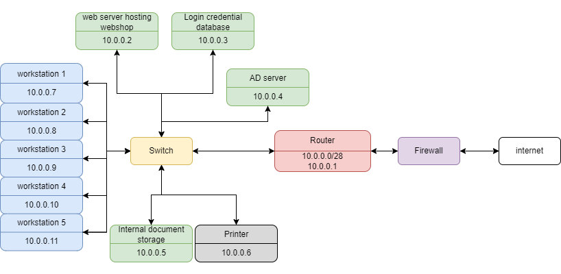

# Networking case study
[Geef een korte beschrijving van het onderwerp]

## Key-terms
[Schrijf hier een lijst met belangrijke termen met eventueel een korte uitleg.]

## Opdracht
### Gebruikte bronnen
[herhaling uitleg switch](https://www.youtube.com/watch?v=9eH16Fxeb9o)  
mooi schematisch overview inclusief firewall  

### Ervaren problemen
[Geef een korte beschrijving van de problemen waar je tegenaan bent gelopen met je gevonden oplossing.]

### Resultaat
Needed:  
    A web server where our webshop is hosted
    A database with login credentials for users on the webshop
    5 workstations for the office workers
    A printer
    An AD server
    A file server containing internal documents  

Network security is important  
AD server seems to be advertising server  
10 connecties zonder route; gebruik /28 voor 14 usable hosts  
Herinnering: switches zijn voor in hetzelfde netwerk; alle interne apparatuur zit dus aan een switch. De switch zit aan de router. De switch heeft zelf geen IP adres.  

Resultaat:  
