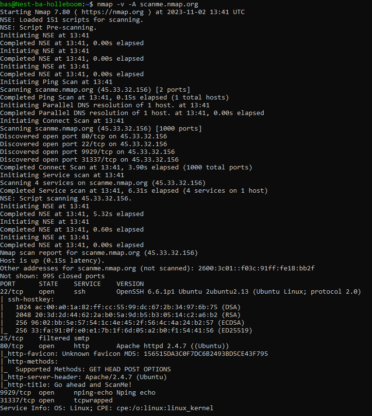
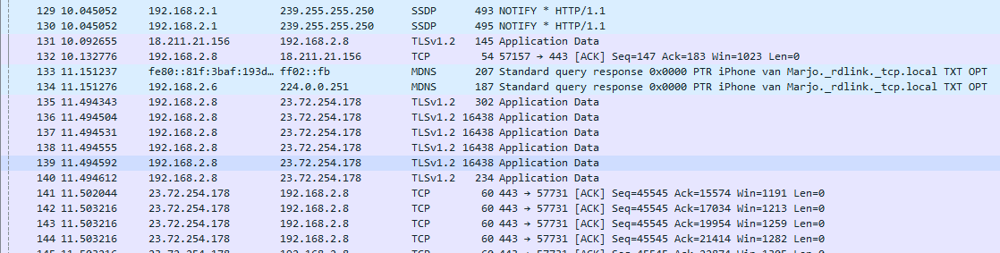
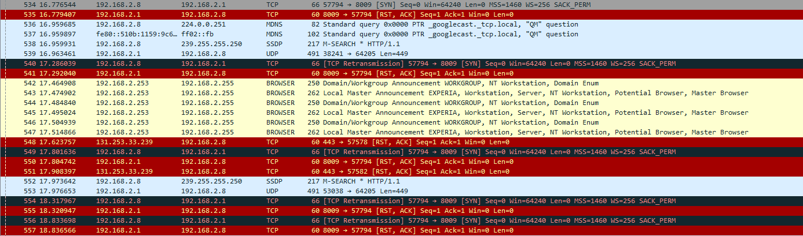

# Network Detection
[Geef een korte beschrijving van het onderwerp]

## Key-terms
Nmap - Network mapper programma

## Opdracht
### Gebruikte bronnen
[Plaats hier de bronnen die je hebt gebruikt.]

### Ervaren problemen
[Geef een korte beschrijving van de problemen waar je tegenaan bent gelopen met je gevonden oplossing.]

### Resultaat
#### exercise 1 Scan the network of your Linux machine using nmap. What do you find?
Nmap staat nog niet op de VM, heb ik geïnstalleerd met sudo apt install nmap  
nmap scan met nmap -v -A scanme.nmap.org  
  
aan het eind staat: Nmap done: 1 IP address (1 host up) scanned in 17.10 seconds  
gaat deze opdracht dan over het vinden van 1 ip adres, omdat ik het netwerk moet vinden?  

#### exercise 2 Open Wireshark in Windows/MacOS Machine. Analyse what happens when you open an internet browser. (Tip: you will find that Zoom is constantly sending packets over the network. You can either turn off Zoom for a minute, or look for the packets sent by the browser between the packets sent by Zoom.)
als ik scan met Wireshark zie ik voor het openen van een browser alleen SSDP, DNS, TLS, en TCP dingen voorbij komen, vaak met privé ip oorsprong en destinatie, al zie ik ook 23 codes voorbij komen. Alles is in lichtblauwe tinten.  
  

na opstart zag ik veel codes in andere kleuren  
  
Ook hier is ook nog een hoop privé overleg, maar soms, vaak met quick codes wordt er vaker naar andere IP adressen gestuurd. 