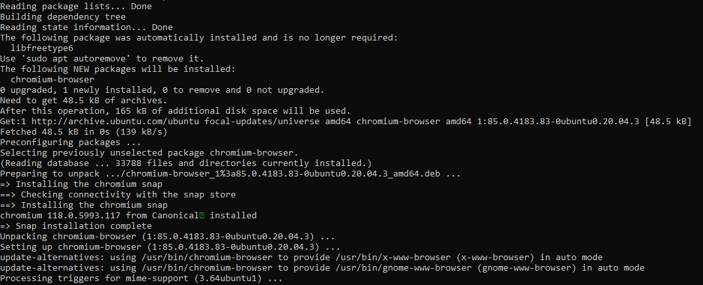

# Firewalls
[Geef een korte beschrijving van het onderwerp]

## Key-terms
Stateful firewall - Stateful firewalls onthouden de verschillende states van vertrouwde actieve sessies. Hierbij hoeft een stateful firewall niet elke pakketje te scannen voor deze verbindingen  
Stateless firewall - A stateless firewall is one that doesn’t store information about the current state of a network connection. Instead, it evaluates each packet individually and attempts to determine whether it is authorized or unauthorized based on the data that it contains.
Hardware firewall - een fysiek apparaat dat dient als firewall, hierdoor hoef je niet individueel op iedere computer achter deze firewall nog iets te installeren
Software firewall - software op een apparaat dat dient als firewall

## Opdracht
### Gebruikte bronnen
[stateless firewall](https://www.checkpoint.com/cyber-hub/network-security/what-is-firewall/what-is-a-stateless-firewall/)  
[hardware en software firewall](https://www.fortinet.com/resources/cyberglossary/hardware-firewalls-better-than-software)  
[chromium op vm krijgen](https://linuxconfig.org/ubuntu-22-04-chromium-browser-installation)  
[apache installatie](https://cloud.google.com/compute/docs/tutorials/basic-webserver-apache)

### Ervaren problemen
[Geef een korte beschrijving van de problemen waar je tegenaan bent gelopen met je gevonden oplossing.]

### Resultaat
#### notities firewalls
Stateful vs. Stateless Firewalls - Stateful houdt iets van de huidige status van het actieve netwerk bij, waardoor ze aanvallen kunnen blokkeren die stateless zou missen, oftewel, als er meerdere pakketten zijn die achter elkaar worden gestuurd voor controle kan de stateful hier fouten in vinden.  

nodig voor de opdracht: 
    Je Linux machine  
    Je unieke poortnummer voor http-verkeer  
ik neem aan dat mijn poortnummer gewoon 52214 is, waar ik ook mee connect  

#### Installeer een webserver op je VM.
chromium maar geïnstalleerd als browser mbv  
    sudo apt update  
    sudo apt install chromium-browser  

installatiebericht:  
  

moet een webserver doen, niet webbrowser, maar dit is nog steeds leuk. 

#### Bekijk de standaardpagina die met de webserver geïnstalleerd is via je browser op je pc/laptop.

#### Stel de firewall zo in dat je webverkeer blokkeert, maar wel ssh-verkeer toelaat.

#### Controleer of de firewall zijn werk doet.
