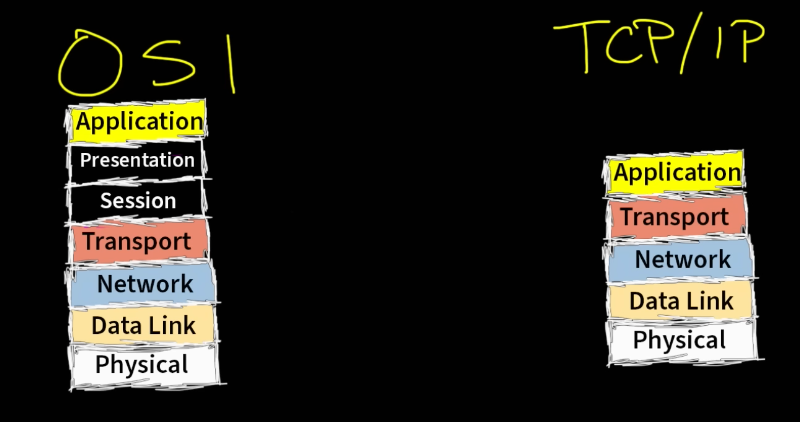

# Introduction
Introduction of OSI model and TCP/IP model

## Key-terms
OSI model - Open System Interconnection model  
TCP/IP model - Internet Protocol suite

## Opdracht
### Gebruikte bronnen
[Plaats hier de bronnen die je hebt gebruikt.]

### Ervaren problemen
[Geef een korte beschrijving van de problemen waar je tegenaan bent gelopen met je gevonden oplossing.]

### Resultaat
TCP/IP is het netwerkmodel dat wordt gebruikt op iedere computer  
Rules, guidelines, standards; functies verdeeld in lagen  
Layers: Physical, Network, Transport, Application  
physical layer soms verdeeld in physical (ethernet cables ed) en data link (adresses, switches)  
network layer = IP adressen  
OSI heeft twee extra lagen: Session en Presentatie  
  
