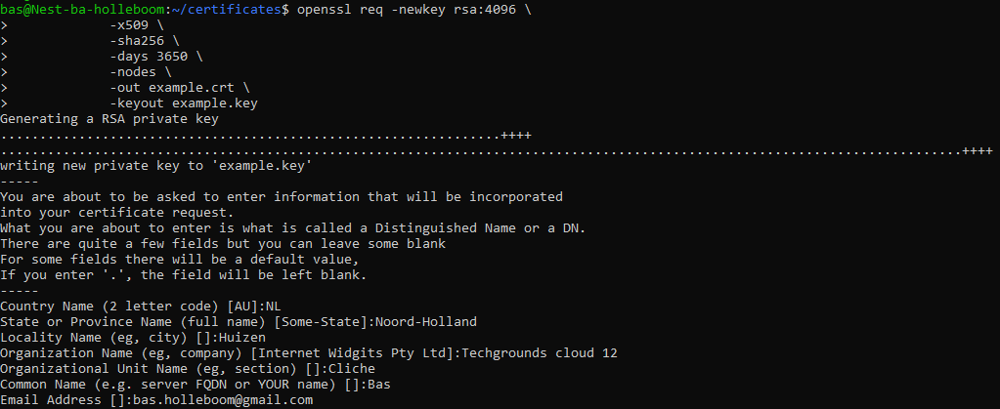
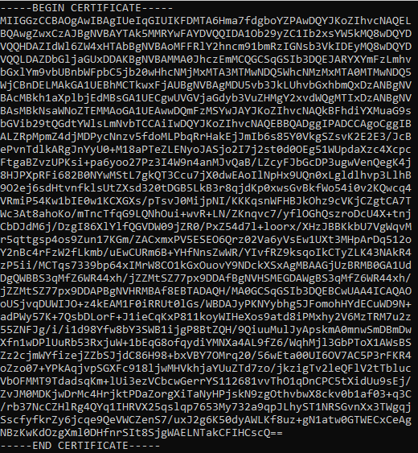
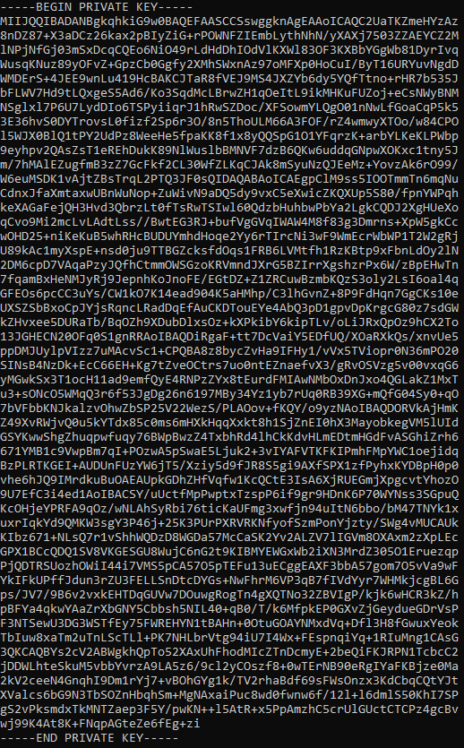
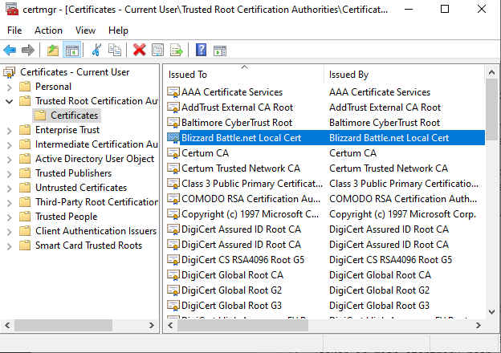

# Public key infrastructure

## Key-terms
PKI - Public Key Infrastructure  
X.509 - standard for PKI  
Root certificate

## Opdracht
### Resultaat
#### Exercise 1 Create a self-signed certificate on your VM
Heb het voorbeeld gebruikt van bron 2:  
openssl req -newkey rsa:4096 \  
            -x509 \  
            -sha256 \  
            -days 3650 \  
            -nodes \  
            -out example.crt \  
            -keyout example.key  

Mooie uitleg codes van bron 2:  
    -newkey rsa:4096 - Creates a new certificate request and 4096 bit RSA key. The default one is 2048 bits.  
    -x509 - Creates a X.509 Certificate.  
    -sha256 - Use 265-bit SHA (Secure Hash Algorithm).  
    -days 3650 - The number of days to certify the certificate for. 3650 is ten years. You can use any positive integer.  
    -nodes - Creates a key without a passphrase.  
    -out example.crt - Specifies the filename to write the newly created certificate to. You can specify any file name.  
    -keyout example.key - Specifies the filename to write the newly created private key to. You can specify any file name.  

Certificatie aanmaak:  
  

.crt en .key  

  

#### Exercise 2 Analyze some certification paths of known websites 
SSL certificaat staat https:// toe, staat SSL/TLS encryptie toe  
Door op het slotje te klikken bij de websitebalk verschijnt website-informatie  

Begin bij Techgrounds, zegt verbinding beveiligd, als ik daarop klik verteld hij dat geverifieerd is door Let's encrypt. Hier kan ik klikken voor meer informatie. Vervolgens laat hij bij de technische details de versleutelde verbinding zien, en dat het TLS is.  

Ik kan ook kiezen voor certificaat bekijken, waar een hoop informaties, publieke sleutels, en vingerafdrukken staan; zie RSA algoritme, sleutelgrootte van 2048, exponent van 65537, en een modulus. De vingerafdrukken zijn SHA-256 en SHA-1.  

als ik bij de NOS kijk is de informatie bij de publieke sleutel gelijk tov techgrounds, op de modulus na. is dit mijn sleutel? Zelfde geld voor de Rabobank  

Certificaten lijken bij derden te zijn opgeslagen? Voor de NOS en Rabobank zijn dit toevallig dezelfde uitgevers.  
Er zijn altijd vingerafdrukken in SHA-256 en SHA-1  

#### Exercise 3 Find the list of trusted certificate roots on your pc/laptop (bonus points if you also find it in your VM). 
Op pc:  
Ging eert via run>mmc, added certificate snap-in  
Zoeken in mijn startmenu naar "certificate" laat mij ook "manage computer certificates" en "manage user certificates" zien  
het zijn hoe dan ook veel certificates, verdeeld over verschillende mappen.  
Voorbeeld submaps user certificates; toen ik de blizzard map inspecteerde laat hij dingen als signature algoritme en public key zien:  

VM: 
volg replies in bron 5  
zowel  
awk -v cmd='openssl x509 -noout -subject' '  
    /BEGIN/{close(cmd)};{print | cmd}' < /etc/ssl/certs/ca-certificates.crt  
    en  
    een ls in /etc/ssl/certs  
geven een hoop data

### Ervaren problemen
#### Exercise 1
[Geef een korte beschrijving van de problemen waar je tegenaan bent gelopen met je gevonden oplossing.]

### Gebruikte bronnen
[x.509](https://en.wikipedia.org/wiki/X.509)  
[creating self-signed certificate](https://linuxize.com/post/creating-a-self-signed-ssl-certificate/)  
[info ssl certificate](https://www.cloudflare.com/learning/ssl/what-is-an-ssl-certificate/)  
[root certificate](https://en.wikipedia.org/wiki/Root_certificate)  
[way to find my root certificates](https://learn.microsoft.com/en-us/skype-sdk/sdn/articles/installing-the-trusted-root-certificate)  
[list al available ssla ca certificates](https://unix.stackexchange.com/questions/97244/list-all-available-ssl-ca-certificates)