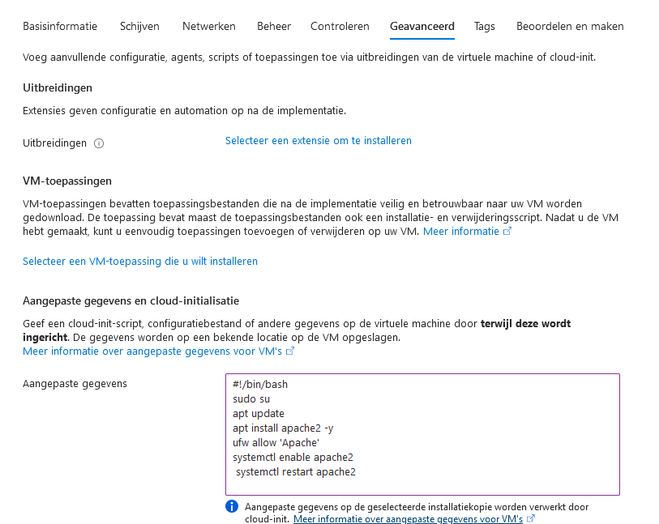

# Virtual machines

## Key-terms
[Schrijf hier een lijst met belangrijke termen met eventueel een korte uitleg.]

## Opdracht
### Uitwerking en Resultaat
#### Exercise 1
  
  
  
  
  
hierna vm gestopt en verwijderd

### Ervaren problemen
#### Exercise 1
[Geef een korte beschrijving van de problemen waar je tegenaan bent gelopen met je gevonden oplossing.]

### Gebruikte bronnen
[Plaats hier de bronnen die je hebt gebruikt.]