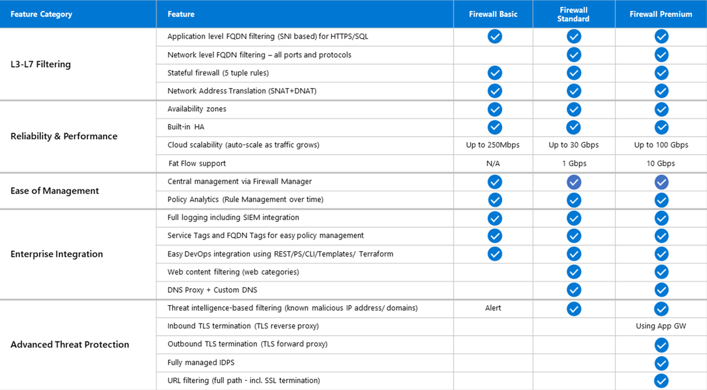

# Firewalls

## Key-terms
VNet - virtual network  
NSG - Network Security Group

## Opdracht
### Uitwerking en Resultaat
#### Exercise 1 Het verschil tussen Basic en Premium Firewall. Het verschil tussen een Firewall en een Firewall beleid (Firewall Policy). Dat Azure Firewall veel meer is dan alleen een firewall. Het verschil tussen Azure Firewall en NSG.
  

Firewall policies let you group several firewall rules so that you can update them all at once, effectively controlled by Identity and Access Management (IAM) roles  

"Unlike Azure Firewall, which monitors all traffic for workloads, NSG is commonly deployed for individual vNets, subnets, and network interfaces for virtual machines to refine traffic. It does so by activating a rule (allow or deny) or Access Control List (ACL), which allows or denies traffic to Azure resources."  
NSGs lijken dus te gaan over permissies tussen azure groepen

#### Exercise 2
Maak nieuwe vm, hierin wordt ook een vnet aangemaakt, html en ssh staan aan  
inloggen met ssh lukt  
misschien moet ik een testopslag aanmaken met daar de standaard website files op en dit linken  
voor nu is het ssh blokkeren in ieder geval gelukt, ik krijg een time-out bij een ssh login die ik voor de blokade niet kreeg.  
  
ochtendupdate: misschien heb ik de opdracht technisch gezien al afgerond  
bonus van thomas: apache2 installeren, dan heb je wel website  
bij setup: 
        #!/bin/bash

        sudo su

        apt update

        apt install apache2 -y

        ufw allow 'Apache'

        systemctl enable apache2

        systemctl restart apache2

### Ervaren problemen
#### Exercise 1
[Geef een korte beschrijving van de problemen waar je tegenaan bent gelopen met je gevonden oplossing.]

### Gebruikte bronnen
[azure firewall overview](https://learn.microsoft.com/en-us/azure/firewall/overview)  
[azure premium firewall](https://learn.microsoft.com/en-us/azure/firewall/premium-features)  
[basic vs standard vs premium](https://learn.microsoft.com/en-us/azure/firewall/choose-firewall-sku)  
[firewall policies](https://cloud.google.com/firewall/docs/firewall-policies-overview)  
[azure firewall vs NSGs](https://www.corestack.io/azure-security-tools/azure-firewall-vs-nsg/)  
[azure firewall vs NSGs from learn](https://learn.microsoft.com/en-us/answers/questions/1164114/whats-the-difference-between-an-nsg-and-azure-fire)  
[NSGs](https://learn.microsoft.com/en-us/azure/virtual-network/network-security-groups-overview)