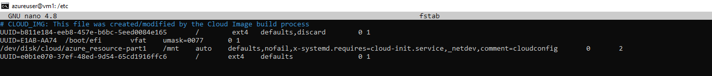
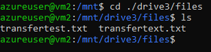

# Azure disk storage

## Key-terms
[Schrijf hier een lijst met belangrijke termen met eventueel een korte uitleg.]

## Opdracht
### Uitwerking en Resultaat
#### Exercise 1
2 VMs aangemaakt  
ssh -i ~/.ssh/vm1_key.pem azureuser@20.86.55.113  
ssh -i ~/.ssh/vm2_key.pem azureuser@20.86.55.132  
ga naar schijven, nieuwe schijf aanmaken
heb gedeelde schijf aangezet  
na aanmaken in beide vms bij instellingen schijven bestaande schijven gekoppeld  
heb via command prompt een directory 'files' aangemaakt met daarin transfertext.txt met als inhoud 'lorem ipsum'  

met sudo fdisk -l (en deels lsblk -f) heb ik info over mijn harde schijven weten te vinden. Ik zie geen namen maar 'sdc' komt overeen met de gedeelde schijf: Disk /dev/sdc  
er lijkt geen partition te zijn, aanmaken met sudo fdisk /dev/sdc  
met sudo mkfs.ext4 /dev/sdc1 partition geformat  
partition sdc1 bestaat nu, maar kan nog niet vinden in /etc/fstab  
sudo blkid -c /dev/null laat zien dat de partition bestaat met zijn ext typing  
sudo blkid data: /dev/sdc1: UUID="e0b1e070-37ef-48ed-9d54-65cd1916ffc6" TYPE="ext4" PARTUUID="3d7b085f-01"  
  
na het aanpassen van fstab lijkt hij wel te mounten met sudo mount /dev/sdc1 , dit is bevestigd der commands waarbij hij zegt dat hij al gemount is, maar wel zonder een directory behalve '/', maak hiervoor na unmounten met umount /mnt/drive2 aan.  
hermount met sudo mount /dev/sdc1 /mnt/drive2  
pas fstab ook aan in mijn 2e drive, mounten lijkt niet te lukken  
uiteindelijk toch wel met sudo mount /dev/sdc1 /mnt/drive2 , lsblk -f laat nu ook de sdc1 partition zien  

nu momentopname maken  

weer als gedeelde schijf gedaan, verbonden aan mijn vm2  
sdd
└─sdd1  ext4                   e0b1e070-37ef-48ed-9d54-65cd1916ffc6  
    sudo mkdir /mnt/drive3  
    sudo mount /dev/sdd1 /mnt/drive3
noot: de unique id is hetzelfde; als ik sdc dismount kan ik inderdaad niet meer bij de data, zo te zien wordt er een DATALOSS_WARNING_README.txt aangemaakt hierdoor  
openen in drive 3 lukt wel gewoon  

### Ervaren problemen
#### Exercise 1
[Geef een korte beschrijving van de problemen waar je tegenaan bent gelopen met je gevonden oplossing.]

### Gebruikte bronnen
[azure managed disk](https://learn.microsoft.com/en-us/azure/virtual-machines/managed-disks-overview)  
[disk switch](https://askubuntu.com/questions/100568/what-is-the-equivalent-for-switching-drives-in-terminal-on-linux)  
[create partition](https://www.digitalocean.com/community/tutorials/create-a-partition-in-linux)  
[partition info](https://superuser.com/questions/643765/creating-ext4-partition-from-console)  
[fstab aanpassen](https://askubuntu.com/questions/303497/how-to-add-an-entry-to-fstab)