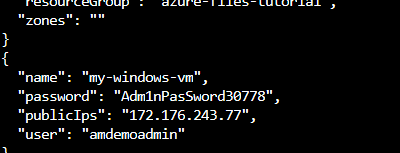
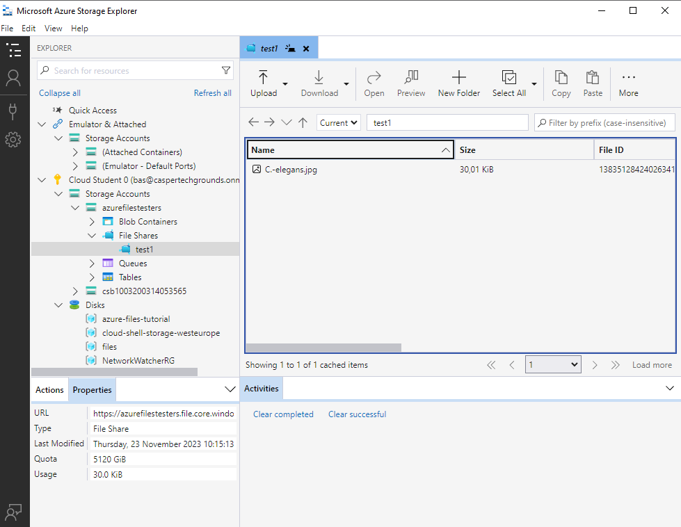
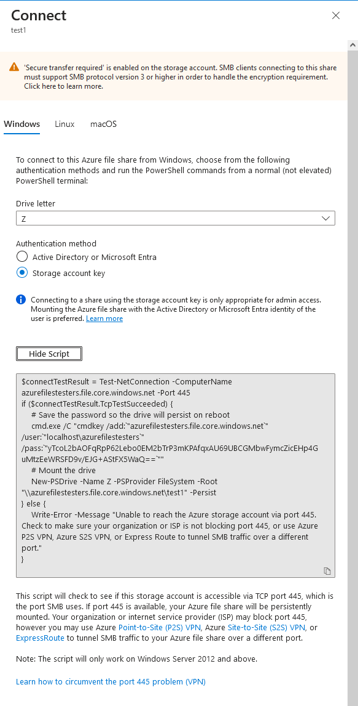

# [Onderwerp]

## Key-terms
[Schrijf hier een lijst met belangrijke termen met eventueel een korte uitleg.]

## Opdracht
NOOT: een deel van deze onderwerpen is al langsgekomen bij azure core services van week 4  
### Praktische Kennis
#### Azure Files
Azure Files offers fully managed file shares in the cloud that are accessible via the industry standard Server Message Block (SMB) protocol, Network File System (NFS) protocol, and Azure Files REST API

##### Welk probleem lost X op?
vervangen on-premise file servers  

##### Welke key termen horen bij X?
SMB - Server message block  
NFS - network file system  
Azure REST API
NAS - network-attached storage  
Lift and shift - verplaatsten van applicatie en/of data naar azure  
azure file sync  
AD DS - active directory domain services  

##### Hoe past X / vervangt X in een on-premises setting?
kan files opslaan op de cloud ipv locale server  
versimpelt verdere cloud development  

##### Hoe kan ik X combineren met andere diensten?
File share kan gebruikt worden in VMs om documenten snel te laden

##### Wat is het verschil tussen X en andere gelijksoortige diensten?
File storage is in verhouding tot blob storage meer voor situaties met standaard file extentions, en is handig voor lift en shift applicaties en cloud development

##### Waar kan ik deze dienst vinden in de console?
Maak een azure storage account, maak in data storage een file share aan  

##### Hoe zet ik deze dienst aan?

##### Hoe kan ik deze dienst koppelen aan andere resources?
Je kan hem mounten op een computer, support voor azure storage explorer

heb Adam Marczak's voorbeeld gevolgd; een file share aangemaakt; via bash een windows vm aangemaakt, verbonden met remote desktop connection manager  
  

in deze vm verbonden met file share met dit script:  
$connectTestResult = Test-NetConnection -ComputerName azurefilestesters.file.core.windows.net -Port 445
if ($connectTestResult.TcpTestSucceeded) {
    # Save the password so the drive will persist on reboot
    cmd.exe /C "cmdkey /add:`"azurefilestesters.file.core.windows.net`" /user:`"localhost\azurefilestesters`" /pass:`"yTcoL2bAOFqRpP62Lebo0EM2bTrP3mKPAfqxAU69UBCGMbwFymcZicEHp4GuMtzEeWRSFD9v/EJG+AStFX5WaQ==`""
    # Mount the drive
    New-PSDrive -Name Z -PSProvider FileSystem -Root "\\azurefilestesters.file.core.windows.net\test1" -Persist
} else {
    Write-Error -Message "Unable to reach the Azure storage account via port 445. Check to make sure your organization or ISP is not blocking port 445, or use Azure P2S VPN, Azure S2S VPN, or Express Route to tunnel SMB traffic over a different port."
}  

poort 445 blokkeerd, vermoedelijk geblokkeerd door de isp  
Azure storage explorer laat ook gewoon zien dat het werkt:  
  

kan dus wel via een andere vm verbinden door bij de file share te klikken op 'connect', geeft een scherm als dit:  
  

Er is een automatische lock op mijn file share gegooid, moet casper geloof ik weghalen

#### SQL Databases in Azure
##### Welk probleem lost X op?
een database voor relationele databases, wat goed is voor structured data

##### Welke key termen horen bij X?
SQL - structured query language  
PaaS - platform as a service  

##### Hoe past X / vervangt X in een on-premises setting?
het bewaren van gestructureerde data in de cloud ipv een on-premise server. Deze data kan zo ook meteen door andere cloud applicaties gebruikt worden.  

##### Hoe kan ik X combineren met andere diensten?
SQL database kan dienen als database voor de andere diensten   

##### Wat is het verschil tussen X en andere gelijksoortige diensten?
SQL is specifiek voor gestructureerde data in deSQL programmeertaal  

##### Waar kan ik deze dienst vinden in de console?
SQL databases in azure services

##### Hoe zet ik deze dienst aan?
Creëren in azure; er is een server en admin nodig

##### Hoe kan ik deze dienst koppelen aan andere resources?
kan integeren met standaardcode, servernaam.  
oa. Query Editor, Microsoft SQL Server Management Studio kan worden gebruikt om te editen  

#### Azure App Service
##### Welk probleem lost X op?
HTTP-based service for hosting web applications, REST APIs, and mobile back ends

##### Welke key termen horen bij X?

##### Hoe past X / vervangt X in een on-premises setting?
Azure App Service geeft de mogelijkheid om in de cloud web applications te developen ipv on premise. Hiernaast kunnen meteen azure functionaliteiten zoals security en autoscaling toevoegen aan je applicatie.  

##### Hoe kan ik X combineren met andere diensten?
security, compliance features, visual studio integration

##### Wat is het verschil tussen X en andere gelijksoortige diensten?
is specifiek een web application development tool in de cloud, en een happy medium qua grootte. Een Virtual Machine zou je gebruiken als je meer controle nodig hebt  

##### Waar kan ik deze dienst vinden in de console?
App Services in azure  

##### Hoe zet ik deze dienst aan?
App Service resource creëren

##### Hoe kan ik deze dienst koppelen aan andere resources?
met virtual network integration kan de appservice outbound calls via een vnet doen  
met MySQL In App kan je een locale MySQL instance runnen. kan hierbij tevens data importeren en exporteren.  

### Theoretische kennis
#### Azure CDN
##### Welk probleem lost X op?
distributed network of servers that can efficiently deliver web content to users, cached content op servers in de buurt van end users voor minimale latency   

##### Welke key termen horen bij X?
CDN - content delivery network

##### Hoe past X / vervangt X in een on-premises setting?
vervangt een on-premise server en extra sterke internetkabels  

##### Hoe kan ik X combineren met andere diensten?
cached all things web content dat in andere diensten, zoals app services, ontwikkeld is

##### Wat is het verschil tussen X en andere gelijksoortige diensten?

#### Azure DNS
##### Welk probleem lost X op?
Hosting service voor DNS domeinen, meerdere vnets kunnen op 1 dns zone  

##### Welke key termen horen bij X?
DNS - Domain Name System  

##### Hoe past X / vervangt X in een on-premises setting?
By hosting your domains in Azure, you can manage your DNS records by using the same credentials, APIs, tools, and billing as your other Azure services. - zo hoef je dingen niet apart bij te houden als je verder in azure werkt  

##### Hoe kan ik X combineren met andere diensten?
Azure role-based access control 

##### Wat is het verschil tussen X en andere gelijksoortige diensten?
specifiek voor hosten DNS domeinen

### 
### Ervaren problemen
#### Exercise 1
Na het experimenteren met file share is er ergens een lock gekomen waardoor ik de resource niet kan verwijderen. Mijn team wist er ook niks over dus ik heb Casper om assistentie gevraagt  

### Gebruikte bronnen
[storage-files-introduction](https://learn.microsoft.com/en-us/azure/storage/files/storage-files-introduction)  
[azure files tutorial](https://www.youtube.com/watch?v=BCzeb0IAy2k)  
[file storage vs blob storage](https://www.serverless360.com/blog/azure-blob-storage-vs-file-storage)  
[file storage vs blob storage 2](https://stackoverflow.com/questions/75223720/when-should-we-use-file-share-in-azure-as-compared-to-azure-blobs)  
[SQL databases](https://learn.microsoft.com/en-us/azure/azure-sql/database/sql-database-paas-overview?view=azuresql)  
[Azure SQL Database Tutorial](https://www.youtube.com/watch?v=BgvEOkcR0Wk)  
[azure app service overview](https://learn.microsoft.com/en-us/azure/app-service/overview)  
[Azure App Service (Web Apps) Tutorial](https://www.youtube.com/watch?v=4BwyqmRTrx8)  
[app service vnet integration](https://learn.microsoft.com/en-us/azure/app-service/overview-vnet-integration)  
[azure cdn overview](https://learn.microsoft.com/en-us/azure/cdn/cdn-overview)  
[azure dns overview](https://learn.microsoft.com/en-us/azure/dns/dns-overview)  
[understanding DNS in azure](https://www.youtube.com/watch?v=Hiohn35DIqA)  