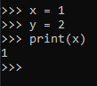

# Variables

## Key-terms
[Schrijf hier een lijst met belangrijke termen met eventueel een korte uitleg.]

## Opdracht
### Uitwerking en Resultaat
#### Exercise 1
voor het runnen van python lijk ik een extension van de marketplace nodig te hebben, download python extension, installeerd automatisch ook pylance  

gebruikte code: 

    x = 1  
    y = 2  
    print(x)  

### Ervaren problemen
#### Exercise 1
[Geef een korte beschrijving van de problemen waar je tegenaan bent gelopen met je gevonden oplossing.]

### Gebruikte bronnen
https://www.w3schools.com/python/python_variables.asp