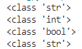
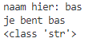

# Data types and comments

## Key-terms
Boolean - binary statement that is either true or false  
String array of characters in quotation marks  
Int - integer, whole number, positive or negative  
Float - floating-point number, number with decimals  

## Opdracht
### Uitwerking en Resultaat
#### Exercise 1
gebruikte code:  
    a = 'int'  
    b = 7  
    c = False  
    d = "18.5"  
    print(type(a))  
    print(type(b))  
    print(type(c))  
    print(type(d))  

resultaat:  
  

subopdracht  
code:  

    a = 'int'  
    b = 7  
    c = False  
    d = "18.5"  
    x = float(b) + float(d)  
    print(x)  

resultaat: 25.5  

met een hashtag kan je comments bij iets zetten  

#### Exercise 2
Code:  
    naam=input('naam hier: ')  
    print('je bent', naam)  
    print(type(naam))  

Resultaat:  
  

de class lijkt steeds string te zijn  

### Ervaren problemen
#### Exercise 1
[Geef een korte beschrijving van de problemen waar je tegenaan bent gelopen met je gevonden oplossing.]

### Gebruikte bronnen
[1](https://www.simplilearn.com/tutorials/python-tutorial/python-typeof-function)  
[2](https://stackoverflow.com/questions/402504/how-to-determine-a-python-variables-type)  
[3, float](https://www.programiz.com/python-programming/methods/built-in/float)  
[user input 1](https://www.w3schools.com/python/python_user_input.asp)  
[user input 2](https://www.geeksforgeeks.org/taking-input-in-python/)  
