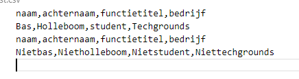

# Key-value pairs

## Key-terms
[Schrijf hier een lijst met belangrijke termen met eventueel een korte uitleg.]

## Opdracht
### Uitwerking en Resultaat
#### Exercise 1
    dict = {  
        "First name": "Casper",  
        "Last name": "Velzen",  
        "Job title": "Learning coach",  
        "Company": "Techgrounds"  
    }  
    for x, y in dict.items():  
        print(x, y)  

#### Exercise 2
Code: 
    naam=input('naam: ')  
    achternaam=input('achternaam: ')  
    functietitel=input('functietitel: ')  
    bedrijf=input('bedrijf: ')  

    dict = {  
        "naam": naam,  
        "achternaam": achternaam,  
        "functietitel": functietitel,  
        "bedrijf": bedrijf  
    }  
    #for x, y in dict.items():  
    #   print(x, y)  

    import csv  

    # csv header  
    fieldnames = ['naam', 'achternaam', 'functietitel', 'bedrijf']  

    # csv data  
    rows = [  
        {"naam": naam,  
        "achternaam": achternaam,  
        "functietitel": functietitel,  
        "bedrijf": bedrijf}  
    ]  

    # met 'a' append je ipv overwrite  
    with open('list.csv', 'a', encoding='UTF8', newline='') as f:  
        writer = csv.DictWriter(f, fieldnames=fieldnames)  
        writer.writeheader()  
            writer.writerows(rows)  

levert resultaten als:  
  

### Ervaren problemen
#### Exercise 1
[Geef een korte beschrijving van de problemen waar je tegenaan bent gelopen met je gevonden oplossing.]

### Gebruikte bronnen
[python dictionaries](https://www.w3schools.com/python/python_dictionaries.asp)  
[dictionary loop](https://www.w3schools.com/python/python_dictionaries_loop.asp)  
[how to write to CSV files](https://www.pythontutorial.net/python-basics/python-write-csv-file/)  