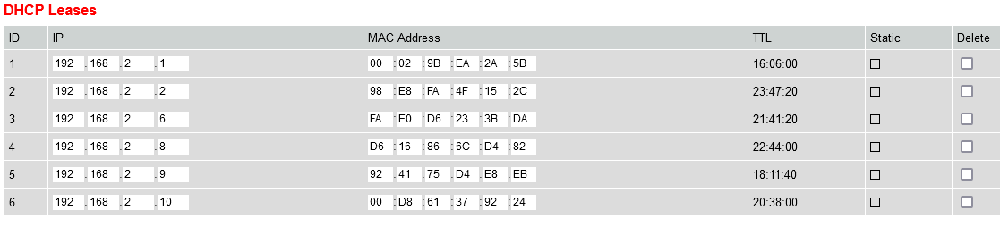
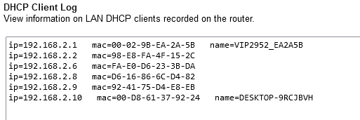
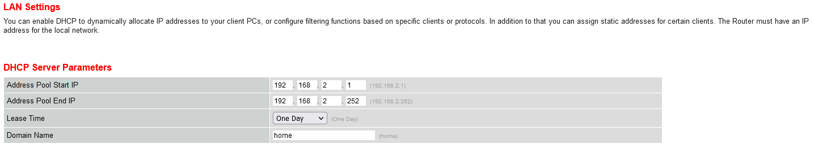

# Networking Devises
[Geef een korte beschrijving van het onderwerp]

## Key-terms
router - forward data packets  
switch - receives and forwards data through packet switching, stuurt het naar de juiste persoon  
repeaters - herhaalt signaal zodat het over grotere afstanden kan reizen  
access point - wireless acces point is waar wifi toegang heeft tot een bekabeld netwerk  
HUB - een "domme" switch die niet op gebruikers kan selecteren; stuurt alles wat binnenkomt door naar iedereen die aan de HUB verbonden is

## Opdracht
### Gebruikte bronnen
wikipedia  
[youtube what is a network day 0](https://www.youtube.com/watch?v=S7MNX_UD7vY)  
[youtube what is a network day 1](https://www.youtube.com/watch?v=9eH16Fxeb9o)  
[router ip adres vinden](https://192-168-1-1ip.mobi/find-router-ip-address/)

### Ervaren problemen
[Geef een korte beschrijving van de problemen waar je tegenaan bent gelopen met je gevonden oplossing.]

### Resultaat
Switches allow you to link more than one computer together  
Routers help switches connect  

####subopdracht 2
router adres: http://192.168.2.254  
DHCP Leases - A DHCP lease is a temporary assignment of an IP address to a device on the network  
  
  
ingestelde parameters:  
  
