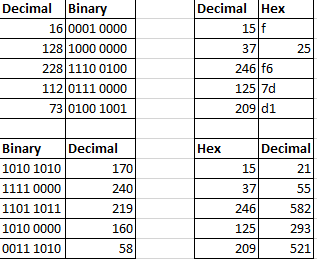
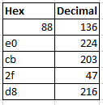

# Counting in binary and hex
Leren over het binaire en hexadecimale systeem

## Key-terms
[Schrijf hier een lijst met belangrijke termen met eventueel een korte uitleg.]

## Opdracht
### Gebruikte bronnen
[hexadecimal tips](https://byjus.com/maths/hexadecimal-number-system/)  
[calculator als controle](calculator.net)
### Ervaren problemen
[Geef een korte beschrijving van de problemen waar je tegenaan bent gelopen met je gevonden oplossing.]

### Resultaat
Binair lijkt altijd te werken met een byte van 8 bits  
Hexadecimaal is 0-f; f is 15  
resultaten:  
  
er miste een deel van de opdracht; restant:  
