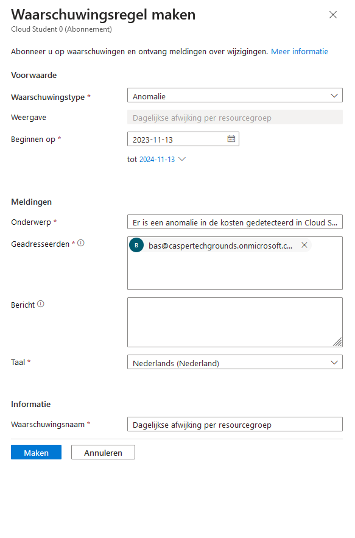

# Azure cost management

## Key-terms
CAPEX - Capital Expenditures  
OPEX - operating expenses  
TCO - Total Cost of Ownership  

## Opdracht
### Uitwerking en Resultaat
#### Exercise 1 Bestudeer: 
De Azure principes voor kostenmanagement  
De voorwaarden van de ‘Free subscription’  
Het verschil tussen CAPEX en OPEX. - Capital expenditures are major purchases that a company makes, which are used over the long term. Operating expenses, on the other hand, are the day-to-day expenses that a company incurs to keep its business running.  
De TCO-calculator  

Ingelogd in op Azure met bas@caspertechgrounds.onmicrosoft.com, heb wachtwoord veranderd  

#### Exercise 2 Maak een alert aan waarmee je eigen kosten kan monitoren; Begrijp de opties die Azure aanbiedt om je uitgaven in te zien.
zocht op cost, klikte op suggestie 'kostenwaarschuwingen', laat kostenbeheer zien.  
dit zie ik als ik op toevoegen druk:  
  
voeg ook bas.holleboom@gmail.com toe
anomaly alert: An anomaly alert email includes a summary of changes in resource group count and cost. It also includes the top resource group changes for the day compared to the previous 60 days. And, it has a direct link to the Azure portal so that you can review the cost and investigate further  
lijkt niks aan te maken, bij waarschuwingsregels laat hij wel wat zien nadat ik iets aanmaakte zonder mijn gmail adres

### Ervaren problemen

### Gebruikte bronnen
[Cost optimization design principles](https://learn.microsoft.com/en-us/azure/well-architected/cost/principles)  
[Azure subscription and service limits, quotas, and constraints](https://learn.microsoft.com/en-us/azure/azure-resource-manager/management/azure-subscription-service-limits)  
[free account](https://azure.microsoft.com/en-us/free)  
[capex vs opex](https://www.investopedia.com/ask/answers/112814/whats-difference-between-capital-expenditures-capex-and-operational-expenditures-opex.asp)  
[TCO calculator](https://azure.microsoft.com/en-us/pricing/tco/calculator/)  
[TCO definition](https://www.techtarget.com/searchdatacenter/definition/TCO)  
[anomaly alert](https://learn.microsoft.com/en-us/azure/cost-management-billing/understand/analyze-unexpected-charges#create-an-anomaly-alert)  
[documentatie cost management](https://learn.microsoft.com/nl-nl/azure/cost-management-billing/costs/)  