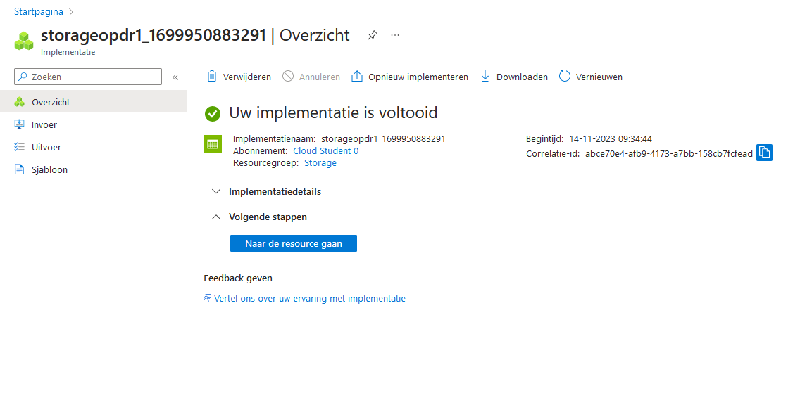

# Azure storage account

## Key-terms
[Schrijf hier een lijst met belangrijke termen met eventueel een korte uitleg.]

## Opdracht
### Uitwerking en Resultaat
#### Exercise 1 Maak een Azure Storage Account. Zorg dat alleen jij toegang hebt tot de data. Plaats data in een storage service naar keuze via de console (bijvoorbeeld een kattenfoto in Blob storage). Haal de data op naar je eigen computer door middel van de Azure Storage Explorer.
Zocht naar storage account, klikte op suggestie "opslagaccounts", dan op maken.  
  
  

Om bestand te uploaden moest ik eerst een container binnen de storage account aanmaken.  
  

Voor het openen in explorer moest ik Microsoft Azure Storage Explorer installeren.
  
  
  

#### Exercise 2 Maak een nieuwe container aan. Upload de 4 bestanden die samen de AWS Demo Website vormen. Zorg dat Static Website Hosting aan staat. Deel de URL met een teamgenoot. Zorg ervoor dat je teamgenoot de website kan zien.
Heb de bestanden geupload in een nieuwe container. Binnen de explorer vind ik de url: https://storageopdr1.blob.core.windows.net/awsdemo  
lijk geen toegang te hebben  
  
op zoek naar access  
als ik de files naar de automatisch aangemaakte $web stuur is daar ook geen access, ligt dus waarschijnlijk aan een globale setting  

heb de settings aangepast maar toen kon hij files niet vinden  
moet aan het eind van de url ook de index.html staan. eg https://storageopdr1.blob.core.windows.net/aws/index.html  
https://storageopdr1.z6.web.core.windows.net/ hier lijkt hij het ook mee te doen  
door wat files cleanup doet link 1 het wel en link 2 het niet  
na een volledig nieuwe opzet lukte het met deze link: https://awsstart.z6.web.core.windows.net/  
heb het ook weer werkend weten te krijgen op mijn eerste opslagaccount, hij doet het zolang je het indexdocument hebt ingevuld  
  

### Ervaren problemen
#### Exercise 1
[Geef een korte beschrijving van de problemen waar je tegenaan bent gelopen met je gevonden oplossing.]

### Gebruikte bronnen
[access](https://techcommunity.microsoft.com/t5/azure-paas-blog/public-access-is-not-permitted-on-this-storage-account/ba-p/3521288)  
[html tip](https://stackoverflow.com/questions/56057614/azure-storage-static-website-error-resource-not-found-or-content-doesnt-exist)