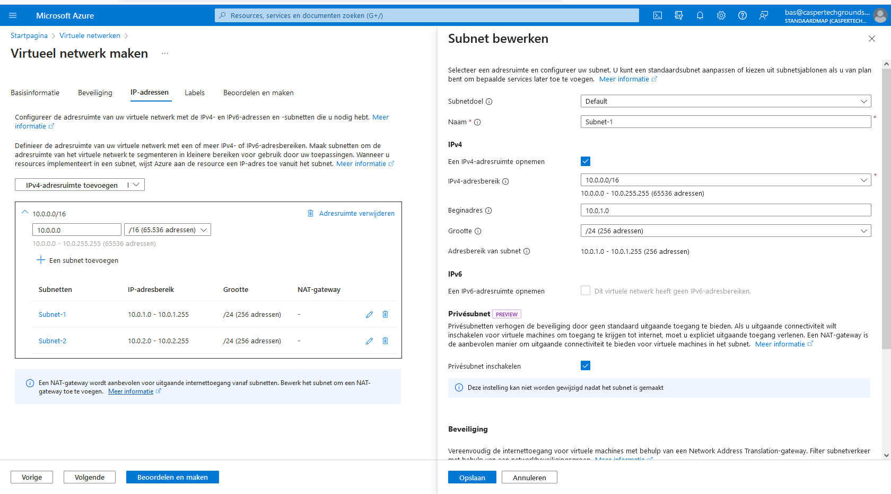
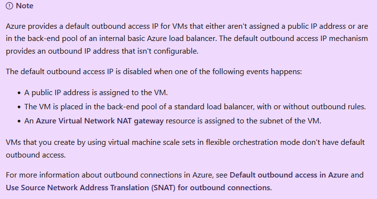

# Azure virtual network

## Key-terms
VNets - Azure Virtual Networks  
Point-to-site VPNs - Het Azure VNet wordt benaderd met een VPN vanaf een on-prem computer  
Site-to-site VPNs - De on-prem VPN device of gateway wordt verbonden met de Azure VPN Gateway. Hierdoor krijg je effectief 1 groot local network  
Azure Expressroute - Dit is een fysieke verbinding vanaf je lokale omgeving naar Azure  
UDR - User defined routing  

## Opdracht
### Uitwerking en Resultaat
#### Exercise 1
In azure een vnet aangemaakt; subnet-1 aangewezen als privesubnet  
  

code voor vm:  
    #!/bin/bash  
    sudo su  
    apt update  
    apt install apache2 -y  
    ufw allow 'Apache'  
    systemctl enable apache2  
    systemctl restart apache2  

Als ik met het ip-adres probeer te verbinden krijg ik een timeout. Ik vermoed dat dit de bedoeling is. Na een periode hercontroleren doet hij het toch wel. Mogelijk omdat public IP expliciet enabled is (door het hebben van een beschikbaarheidszone?).  
  
Als controle maak een vergelijkbare vm op subnet 2  
vm2 loopt vast; ik maak hem opnieuw  
tip van stephan: maak een subnet los van het internet dmv nsg, dan blijft de webpage niet bereikbaar. Ik kan deze oplossing zelf niet vinden. Morgen nog vragen/overleggen.  

### Ervaren problemen
#### Exercise 1
[Geef een korte beschrijving van de problemen waar je tegenaan bent gelopen met je gevonden oplossing.]

### Gebruikte bronnen
[mogelijke bron ip koppelen](https://learn.microsoft.com/en-us/azure/virtual-network/ip-services/associate-public-ip-address-vm?tabs=azure-portal)