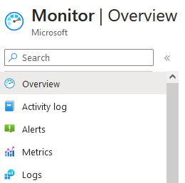

# Azure Monitor

## Theorie
### Welk probleem lost X op?
comprehensive monitoring solution for collecting, analyzing, and responding to monitoring data from your cloud and on-premises environments

### Welke key termen horen bij X?
all kinds of logs  
metrics  
diagnostic settings  
alert rule  
SCOM - System Center Operations Manager  
ITSM - IT service management  

### Hoe past X / vervangt X in een on-premises setting?

### Hoe kan ik X combineren met andere diensten?
monitoren van diensten  

### Wat is het verschil tussen X en andere gelijksoortige diensten?

## Praktijk
### Waar kan ik deze dienst vinden in de console?
Monitor  
bij metrics kan ik grafieken voor verschillende dingen aanzetten  

  

### Hoe zet ik deze dienst aan?

### Hoe kan ik deze dienst koppelen aan andere resources?
bijvoorbeeld door een scope te selecteren bij metrics  
Resources hebben ook een Monitoring subsectie  

## Cost  
The cost of Azure Monitor is based on your usage of different features and is primarily determined by the amount of data you collect  

## Notities
### Ervaren problemen

### Gebruikte bronnen
[learn](https://learn.microsoft.com/en-us/azure/azure-monitor/overview)  
[john savill](https://www.youtube.com/watch?v=v68jL-l9Fww)  
