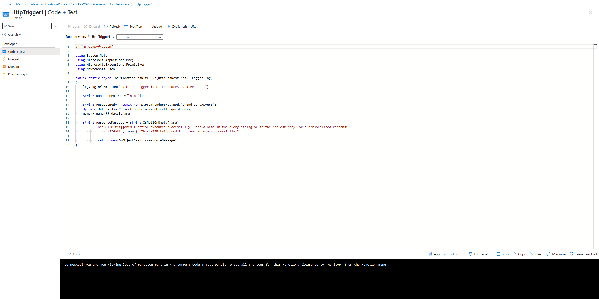

# Azure Functions

## Theorie
### Welk probleem lost X op?
Azure Functions is a serverless solution that allows you to write less code, maintain less infrastructure, and save on costs. Instead of worrying about deploying and maintaining servers, the cloud infrastructure provides all the up-to-date resources needed to keep your applications running.  

You focus on the code that matters most to you, in the most productive language for you, and Azure Functions handles the rest.  

### Welke key termen horen bij X?
Serverless  
micro/nano-services  

### Hoe past X / vervangt X in een on-premises setting?

### Hoe kan ik X combineren met andere diensten?

### Wat is het verschil tussen X en andere gelijksoortige diensten?
"With Functions, you write your function code in your preferred language using your favorite development tools and then deploy your code to the Azure cloud. Functions provides native support for developing in C#, Java, JavaScript, PowerShell, Python, plus the ability to use more languages, such as Rust and Go.  

Functions integrates directly with Visual Studio, Visual Studio Code, Maven, and other popular development tools to enable seemless debugging and deployments.  

Functions also integrates with Azure Monitor and Azure Application Insights to provide comprehensive runtime telemetry and analysis of your functions in the cloud."  

## Praktijk
### Waar kan ik deze dienst vinden in de console?
Function App  

### Hoe zet ik deze dienst aan?
In een function app kan je een functie aanmaken, hierin kan je vervolgens code zetten en integreren  

  

### Hoe kan ik deze dienst koppelen aan andere resources?

## Notities
### Ervaren problemen

### Gebruikte bronnen
[learn](https://learn.microsoft.com/en-us/azure/azure-functions/functions-overview?pivots=programming-language-csharp)  
[adam marczak](https://www.youtube.com/watch?v=Vxf-rOEO1q4)  
[more adam marczak](https://www.youtube.com/watch?v=inaXkN2UrFE&list=PLGjZwEtPN7j-Q59JYso3L4_yoCjj2syrM&index=10)  