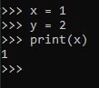
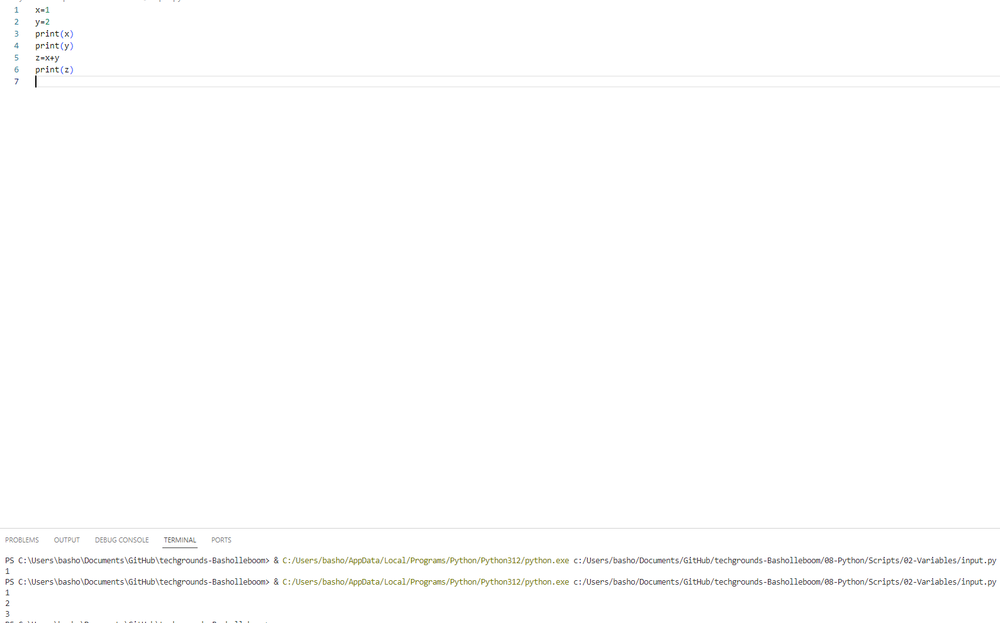
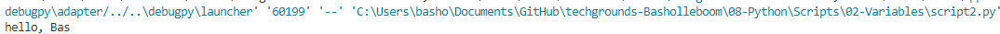
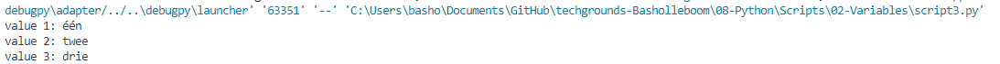

# Variables

## Key-terms
[Schrijf hier een lijst met belangrijke termen met eventueel een korte uitleg.]

## Opdracht
### Uitwerking en Resultaat
#### Exercise 1
gebruikte code: 

    x = 1  
    y = 2  
    print(x)  

Kijk nu hoe ik dit kan doen in VS Code  
voor het runnen van python in VS Code lijk ik een extension van de marketplace nodig te hebben, download python extension, installeerd automatisch ook pylance  
moet bestanden opslaan als .py om het te kunnen runnen  

volledige gebruikte code:  
    x=1  
    y=2  
    print(x)
    print(y)  
    z=x+y  
    print(z)

Resultaat:  
  

#### Exercise 2

Code:  
    YOURNAME='Bas'  
    print("hello,", YOURNAME)  

resultaat:  
  

#### Exercise 3
gebruikte code:  
    var='één'  
    print('value 1:', var)  
    var='twee'  
    print('value 2:', var)  
    var='drie'  
    print('value 3:', var)  

resultaat:  

### Ervaren problemen
#### Exercise 1
[Geef een korte beschrijving van de problemen waar je tegenaan bent gelopen met je gevonden oplossing.]

### Gebruikte bronnen
https://www.w3schools.com/python/python_variables.asp  
python debugger in VS Code