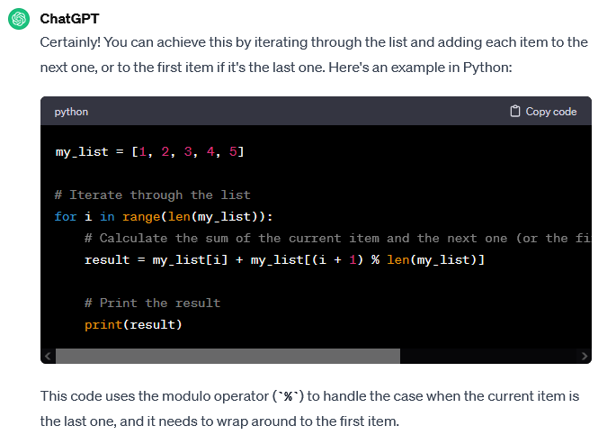

# Lists

## Key-terms
[Schrijf hier een lijst met belangrijke termen met eventueel een korte uitleg.]

## Opdracht
### Uitwerking en Resultaat
#### Exercise 1
ik heb de loop code kunnen gebruiken van script3 van de loop opdracht

#### Exercise 2
    my_list = [9, 80, 16, 67, 35]

    # Iterate through the list  
    for i in range(len(my_list)):  
        # Calculate the sum of the current item and the next one (or the first one if it's the last item)  
        result = my_list[i] + my_list[(i + 1) % len(my_list)]  

        # Print the result  
        print(result)  

### Ervaren problemen
#### Exercise 2
Ik kon zelf geen oplossing verzinnen, dus ik heb ChatGPT gebruikt voor assistentie. Dit leverde werkende code die analyseerde om er zelf wat van te leren.  

### Gebruikte bronnen
[list access](https://www.w3schools.com/python/python_lists_access.asp)  
[loops](https://www.w3schools.com/python/python_for_loops.asp)  