# Als team willen wij duidelijk hebben wat de eisen zijn van de applicatie
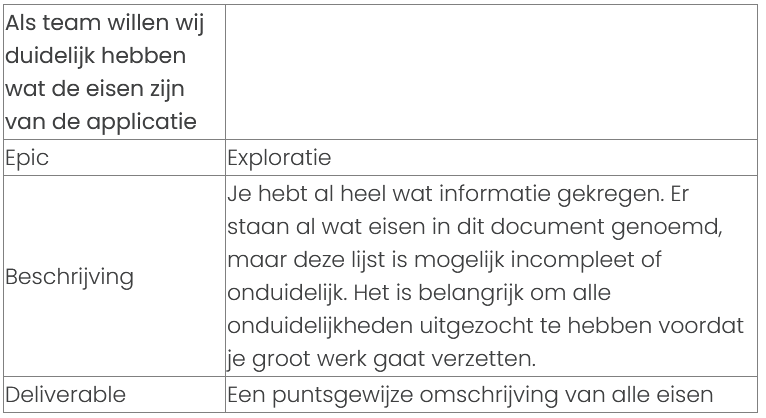
## Wij weten

    Alle VM disks moeten encrypted zijn.
    De webserver moet dagelijks gebackupt worden. De backups moeten 7 dagen behouden worden.
    De webserver moet op een geautomatiseerde manier geïnstalleerd worden.
    De admin/management server moet bereikbaar zijn met een publiek IP.
    De admin/management server moet alleen bereikbaar zijn van vertrouwde locaties (office/admin’s thuis)
    De volgende IP ranges worden gebruikt: 10.10.10.0/24 & 10.20.20.0/24
    Alle subnets moeten beschermd worden door een firewall op subnet niveau.
    SSH of RDP verbindingen met de webserver mogen alleen tot stand komen vanuit de admin server.
    Wees niet bang om verbeteringen in de architectuur voor te stellen of te implementeren, maar maak wel harde keuzes, zodat je de deadline kan halen.

## Vragen

    Is er een specifiek besturingssysteem en type disk vereist
    Is een lage latency vereist
    is er scaling nodig

# Als team willen wij een duidelijk overzicht van de aannames die wij gemaakt hebben. 
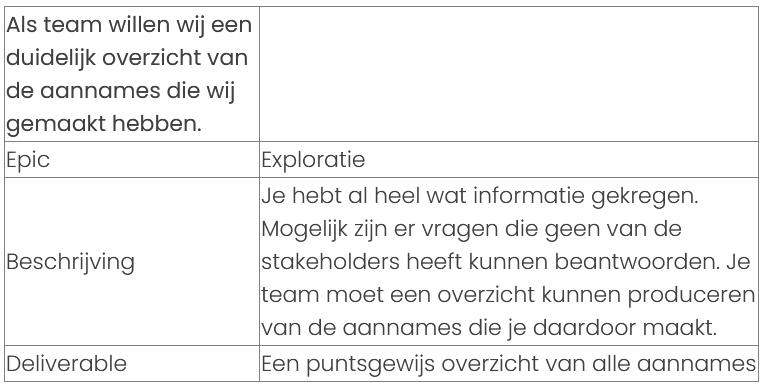

# Als team willen wij een duidelijk overzicht hebben van de Cloud Infrastructuur die de applicatie nodig heeft
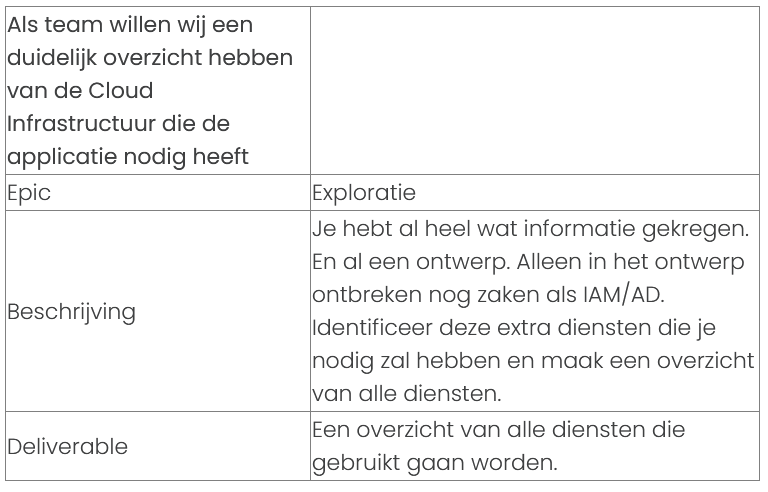

Storage Account  
StorageV2 of Blob  
SQL Database  
Disk Encryption  
2 x Virtual Machines  
2 x Virtual Networks  
Back-up Recovery Vault  
Peering van Virtual Networks  
Key Vault  
2 x Subnet: Management en Webserver/Applicatie  
2 x Network Security Groups (NSG)  
Installeer Apache op Webserver/Applicatie en plaats Placeholder Content  

# Als klant wil ik een werkende applicatie hebben waarmee ik een veilig netwerk kan deployen
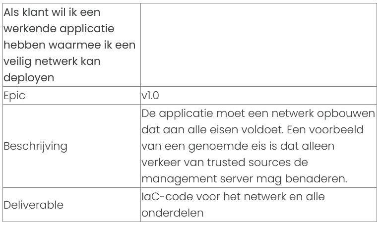

# Als klant wil ik een werkende applicatie hebben waarmee ik een werkende webserver kan deployen 
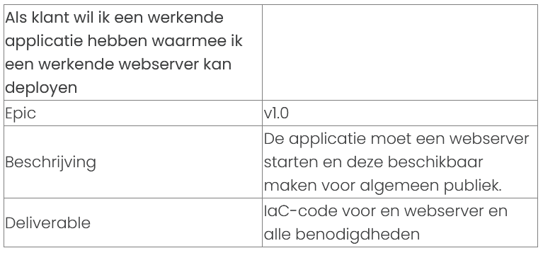

# Als klant wil ik een werkende applicatie hebben waarmee ik een werkende management server kan deployen 
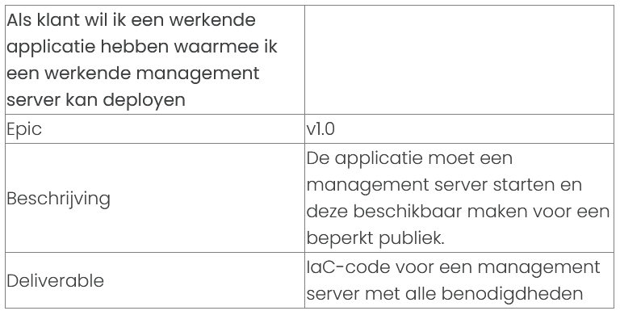

# Als klant wil ik een opslagoplossing hebben waarin bootstrap/post-deployment script opgeslagen kunnen worden 
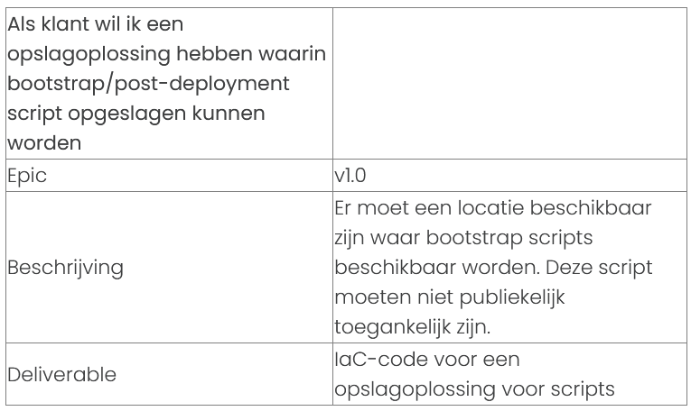

# Als klant wil ik dat al mijn data in de infrastructuur is versleuteld 
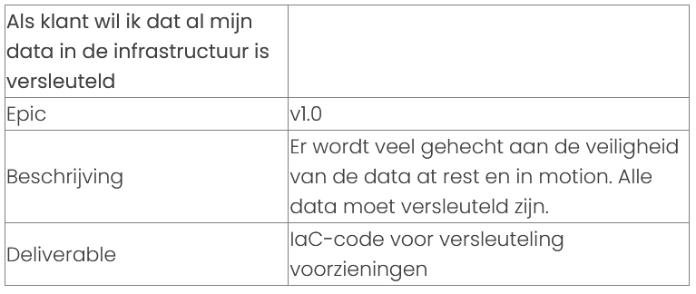

# Als klant wil ik iedere dag een backup hebben dat 7 dagen behouden wordt 
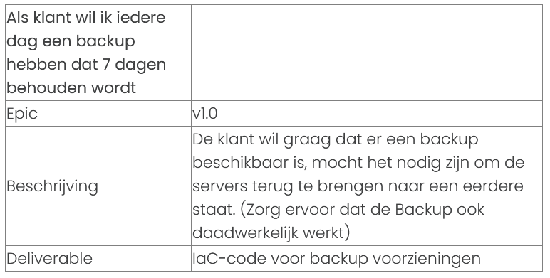

# Als klant wil ik weten hoe ik de applicatie kan gebruiken 
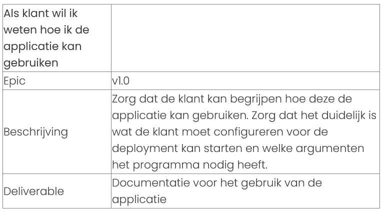

# Als klant wil ik een MVP kunnen deployen om te testen 
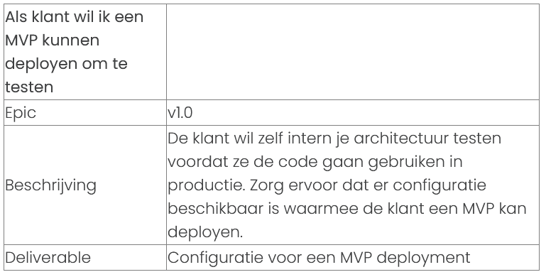

# Story onderwerp
Afbeelding tabel  

uitwerking